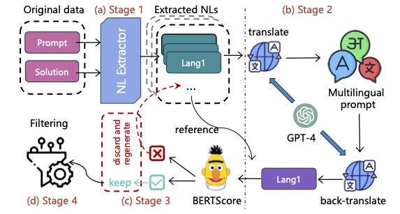

# LREC-COLING 2024 | HumanEval-XL: An Execution-based Multilingual Code Generation Benchmark Across 23 Natural Languages and 12 Programming Languages

This repository contains data and evaluation code for the paper "HumanEval-XL: A Multilingual Code Generation Benchmark for Cross-Lingual Natural Language Generalization".


## 🔥 News
* **26 February, 2024:** 🎉 We release the official codebase and data!🔥
* **19 February, 2024:** 🎉 Our work has been accepted to [LREC-COLING 2024](https://lrec-coling-2024.org/)! ✨

## 🌟 Overview

<div align="center">
  
</div>

Large language models (LLMs) have made significant progress in generating codes from textual prompts. However, existing benchmarks have mainly concentrated on translating English prompts to multilingual codes or have been constrained to very limited natural languages (NLs). These benchmarks have overlooked the vast landscape of massively multilingual NL to multilingual code, leaving a critical gap in the evaluation of multilingual LLMs. In response, we introduce HumanEval-XL, a massively multilingual code generation benchmark specifically crafted to address this deficiency. HumanEval-XL establishes connections between 23 NLs and 12 programming languages (PLs), and comprises of a collection of 22,080 prompts with an average of 8.33 test cases. By ensuring *parallel* data across multiple NLs and PLs, HumanEval-XL offers a comprehensive evaluation platform for multilingual LLMs, allowing the assessment of the understanding of different NLs. Our work serves as a pioneering step towards filling the void in evaluating NL generalization in the area of multilingual code generation. We make our evaluation code and data publicly available at [https://github.com/FloatAI/HumanEval-XL](https://github.com/FloatAI/HumanEval-XL).


## Dataset
The data is stored in `data/program_language/natural_language/`. We have 80 parallel problems in 23 different natural languages and 12 programming languages.  


## Evaluation
### Installation

Check out and install this repository:
```
git clone git@github.com:FloatAI/humaneval-xl.git
cd mxeval
pip install -e mxeval
```

### Dependencies
We provide scripts to help set up programming language dependencies that are used to execute and evaluate using dataset.
(We use the same scripts from https://github.com/amazon-science/mxeval for code generation evaluation)

#### Amazon Linux AMI
```
bash language_setup/amazon_linux_ami.sh
```
#### Ubuntu
```
bash language_setup/ubuntu.sh
```

## Usage

**This program exists to run untrusted model-generated code. Users are strongly
encouraged not to do so outside of a robust security sandbox. See the comment in
`execution.py` for more information and instructions.**
(We use the same scripts from https://github.com/amazon-science/mxeval for code generation evaluation)

Each sample is formatted into a single line:
```
{"task_id": "Corresponding task ID", "completion": "Completion only without the prompt",
"language": "programming language name"}
```
We provide `python_chinese_generated_samples.jsonl` to illustrate the format. 

Here is nearly functional example code (you just have to provide
`generate_one_completion` to make it work) that saves generated completions to
`samples.jsonl`.
```
from mxeval.data import write_jsonl, read_problems

problems = read_problems()

num_samples_per_task = 200
samples = [
    dict(task_id=task_id, language=problems[task_id]["language"], completion=generate_one_completion(problems[task_id]["prompt"]))
    for task_id in problems
    for _ in range(num_samples_per_task)
]
write_jsonl("samples.jsonl", samples)
```

To evaluate the samples for, e.g., Python, Chinese evaluation, run 
```
evaluate_functional_correctness python_chinese_generated_samples.jsonl --problem_file data/python/Chinese.jsonl
```

Note: Because there is no unbiased way of estimating pass@k when there are fewer
samples than k, the script does not evaluate pass@k for these cases. To
evaluate with other k values, pass `--k <comma-separated-values-here>`. For
other options, see
```
$ evaluate_functional_correctness --help
```
However, we recommend that you use the default values for the rest.

## Credits
We adapted Amazon-science's mxeval package (https://github.com/amazon-science/mxeval) for the evaluation. We thank Amazon for their pioneering effort in this field including the release of the dataset and evaluation code.

## Citation
For attribution in academic contexts, please cite this work as:

```
@inproceedings{he-xl-2024-pcl,
  author = {Peng, Qiwei and Chai, Yekun and Li, Xuhong},
  title = {HumanEval-XL: A Multilingual Code Generation Benchmark for Cross-Lingual Natural Language Generalization},
  booktitle = {The 2024 Joint International Conference on Computational Linguistics, Language Resources and Evaluation},
  month = may,
  address = {Torino, Italia},
  year = {2024},
}
```
